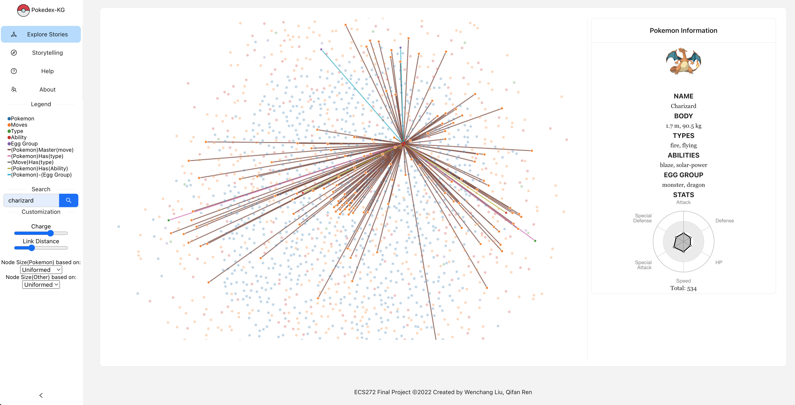

# ECS272 Final Project: Pokedex-KG

## Dataset

* The Pokemon data are from [veekun](https://github.com/veekun/pokedex)
* The csv files we use: abilities, egg_groups, moves, pokemon_abilities, pokemon_egg_groups, pokemon_moves, pokemon_stats, pokemon_types, pokemon, stats, types
* The script we use to generate the json data is: [Preprocessing/gen_json.py](Preprocessing/gen_json.py)

## React Project: pokedex-kg

* `npm install --force`: to install required depencies
* `npm start`: to start the project locally
* We have a online demo at [Vercel](https://ecs272-final-pokedex-kg.vercel.app/) as well
* A preview screenshot of what our project looks like: 
